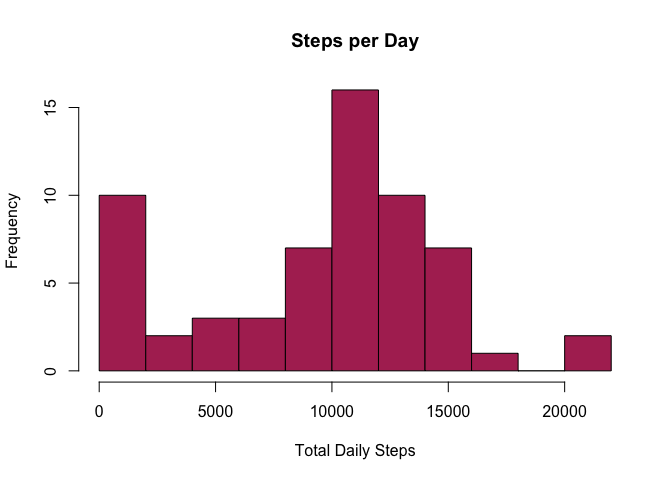
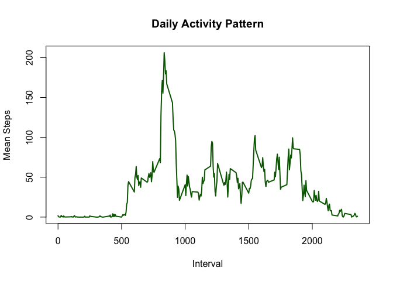
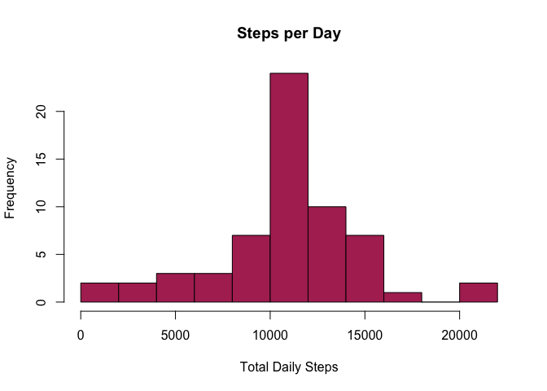
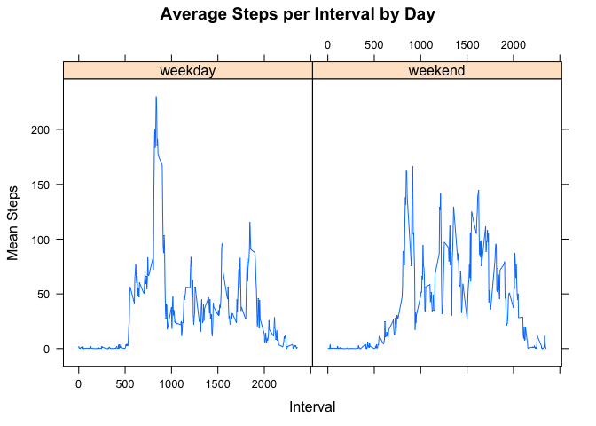

## Introduction

It is now possible to collect a large amount of data about personal
movement using activity monitoring devices such as a
[Fitbit](http://www.fitbit.com), [Nike
Fuelband](http://www.nike.com/us/en_us/c/nikeplus-fuelband), or
[Jawbone Up](https://jawbone.com/up). These type of devices are part of
the "quantified self" movement -- a group of enthusiasts who take
measurements about themselves regularly to improve their health, to
find patterns in their behavior, or because they are tech geeks. But
these data remain under-utilized both because the raw data are hard to
obtain and there is a lack of statistical methods and software for
processing and interpreting the data.

This assignment makes use of data from a personal activity monitoring
device. This device collects data at 5 minute intervals through out the
day. The data consists of two months of data from an anonymous
individual collected during the months of October and November, 2012
and include the number of steps taken in 5 minute intervals each day.


## Data

The data for this assignment can be downloaded from the course web
site:

* Dataset: [Activity monitoring data](https://d396qusza40orc.cloudfront.net/repdata%2Fdata%2Factivity.zip) [52K]

The variables included in this dataset are:

* **steps**: Number of steps taking in a 5-minute interval (missing
    values are coded as `NA`)

* **date**: The date on which the measurement was taken in YYYY-MM-DD
    format

* **interval**: Identifier for the 5-minute interval in which
    measurement was taken

The dataset is stored in a comma-separated-value (CSV) file and there
are a total of 17,568 observations in this
dataset.


## Loading and preprocessing the data

The initial step is to load in relevant packages, read the supplied data, and convert the date column to the date class


```r
#Load packages
library(dplyr)
library(lubridate)
library(lattice)

#Unzip and read data
activity <- read.csv(unz("activity.zip", "activity.csv"))
activity <- transform(activity, date = ymd(date)) #Convert date column to date class
```


## What is mean total number of steps taken per day?

```r
#Find the total number of steps taken per day
sumStep <- tapply(activity$steps, activity$date, sum, na.rm = TRUE)
#Create a histogram showing frequency of each step total
hist(sumStep, main = "Steps per Day", xlab = "Total Daily Steps", breaks = 8,
     col = "maroon")
```

<!-- -->

```r
#Calculate the mean and median step counts
meanStep <- round(mean(sumStep), 0)
medianStep <- median(sumStep)
```

Daily Steps Mean: 9354  
Daily Steps Median: 10395

## What is the average daily activity pattern?

```r
#Calculate the mean for each time interval's step count across all days
meanInt <- tapply(activity$steps, activity$interval, mean, na.rm = TRUE)
#Convert the above result to a data frame
meanInt <- data.frame(int = as.integer(names(meanInt)), mean = meanInt)
#Plot the mean step counts over the the time intervals averaged over all days
with(meanInt, plot(int, mean, type = "l", lwd = 2, col = "darkgreen", 
     main = "Daily Activity Pattern", xlab = "Interval", ylab="Mean Steps"))
```

<!-- -->

```r
#Find the time interval with the highest mean step count
maxInt <- meanInt[which.max(meanInt$mean), "int"]
```

The Interval with the maximum average steps across all days is 835.


## Imputing missing values

```r
#Find the number of rows with missing values
nas <- sum(!complete.cases(activity))

#Create new activity data frame that uses the mean step count for a given interval across all days as the missing values
activity2 <- activity
for(i in seq_along(activity2$steps)) {
    if (is.na(activity2$steps[i])) {
        interval <- activity2$interval[i]
        activity2$steps[i] <- meanInt[meanInt$int == interval, 2]
    }
}
#Find the total number of steps taken per day
sumStep2 <- tapply(activity2$steps, activity2$date, sum, na.rm = TRUE)
#Create a histogram showing frequency of each step total
hist(sumStep2, main = "Steps per Day", xlab = "Total Daily Steps", breaks = 8,
     col = "maroon")
```

<!-- -->

```r
#Calculate the mean and median step counts
meanStep2 <- round(mean(sumStep2), 0)
medianStep2 <- round(median(sumStep2), 0)
```

There are 2304 rows with missing values.  
Daily Steps Mean: 10766   
Daily Steps Median: 10766  
The new values for mean and median are higher when the missing values are replaced with the mean for a given interval across all days.  This imputation also brings the mean and median to be equal and significantly centers the disibution, removing the large cluster near the left of the histogram.


## Are there differences in activity patterns between weekdays and weekends?

```r
#Create a new activity data frame with a factor indicatng whether a data point is on a weekend or weekday
activity3 <- activity2
activity3$Day <-weekdays(activity3$date) %in% c("Saturday", "Sunday")
activity3$Day <- factor(activity3$Day, labels = c("weekday", "weekend"))
#Summarize the data to show average step counts at each interval dependant on the weekday/end factor
sumDat <- summarize(group_by(activity3, interval, Day),
                    meanStep = mean(steps, na.rm= TRUE))
#Plot the average step count per interval for weekends and weekdays
xyplot(meanStep ~interval | Day, data = sumDat, type = "l",
       xlab = "Interval", ylab= "Mean Steps", main = "Average Steps per Interval by Day")
```

<!-- -->

Clearly, there are differing patters in step counts on weekends and weekdays. On weekdays, the maximum step count on a given interval is significantly higher, indicating bursts of higher activity. Additionally, the weekday activity begins earlier in the day than that of the weekend.

